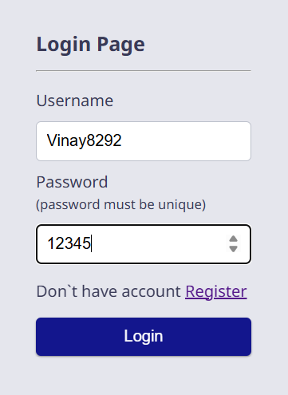
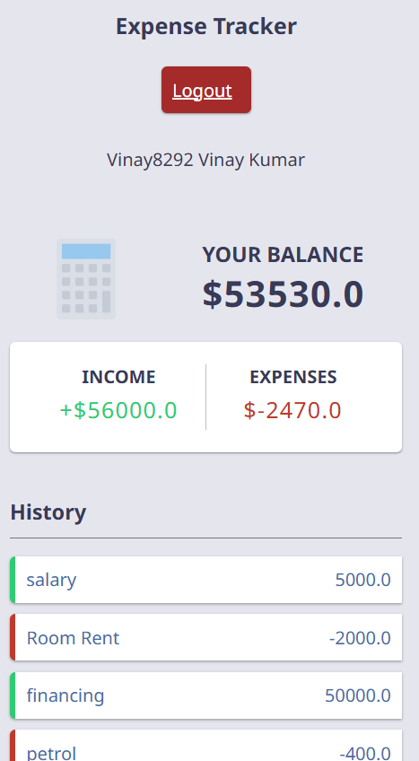
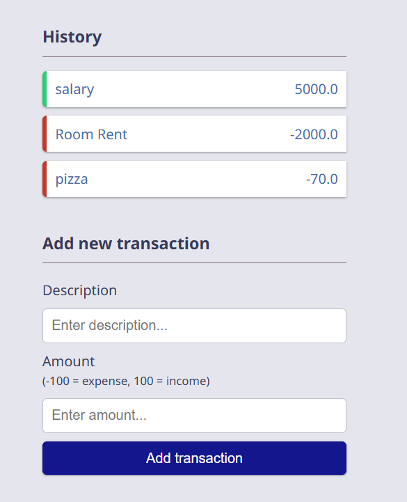

# 💰 Expense Tracker (Django)

A simple and clean Django-based Expense Tracker that helps users record, manage, and monitor their daily expenses.
The project includes user authentication (login system), an expense management app, and a minimal, responsive UI.
---

## 📁 Project Structure

```
ExpenceTracker/
│
├── expensetracker/
│   ├── manage.py
│   ├── db.sqlite3
│   ├── expensetracker/      # Main Django project (settings, URLs)
│   └── tracker/             # Expense management app
│
└── env/                     # Virtual environment (do NOT upload)
```

---

## 🚀 Features

-  User Login & Authentication
- Add daily expenses  
- View, update, and manage expenses  
- Simple Bootstrap UI  
- SQLite-based database  
- Lightweight and beginner-friendly  

---

## 🛠️ Installation

### 1️⃣ Clone the Repository

```bash
git clone https://github.com/vinay829222/Expence_Tracker.git
cd ExpenceTracker/expensetracker
```

### 2️⃣ Create & Activate Virtual Environment

```bash
python -m venv env
env\Scripts\activate     # Windows
source env/bin/activate  # Linux/Mac
```

### 3️⃣ Install Dependencies

```bash
pip install django
```

### 4️⃣ Run Migrations

```bash
python manage.py migrate
```

### 5️⃣ Start the Server

```bash
python manage.py runserver
```

Visit the app:  
👉 http://127.0.0.1:8000/

---

## 📷 Screenshots







---

## 📌 Future Enhancements

- 👥 Multi-user support  
- 📊 Charts & analytics  
- 📄 Export to CSV / PDF  
- 📱 Fully responsive UI  

---

## 🤝 Contributing

Pull requests are welcome!  
Open an issue before making major changes.

---

## 📜 License

This project is open-source and free to use.

---

## 👨‍💻 Author

**Vinay Kumar**  
Feel free to connect or share suggestions!


